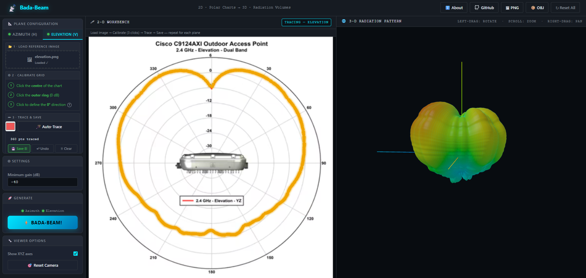

<div align="center">

# BADA-BEAM

**Web-Based 2D Antenna Radiation Pattern to 3D Volume Generator**

[](https://www.gnu.org/licenses/gpl-3.0)

<br/>

<a href="https://www.buymeacoffee.com/clementlg">
  
</a>

</div>

---

## Table of Contents

- [Overview](#overview)
- [Key Features](#key-features)
- [Architecture](#architecture)
- [Visual Interface](#visual-interface)
- [Quickstart](#quickstart)
  - [Using Docker (Recommended)](#using-docker-recommended)
  - [Local Installation](#local-installation)
- [Usage Guide](#usage-guide)
- [Contributing](#contributing)
- [License](#license)

---

## Overview

**BADA-BEAM** is an advanced web application designed to facilitate the translation of 2D antenna radiation patterns into accurate 3D volumetric representations. By importing standard 2D plots for both Azimuth and Elevation planes, RF engineers and enthusiasts can intuitively generate, visualize, and analyze the corresponding 3D radiation structures directly within their browser.

## Key Features

- **Dual-Plane Calibration**: Fully independent workflows to calibrate both Azimuth (Horizontal) and Elevation (Vertical) planes using custom imported images.
- **Smart Auto-Tracing**: Integrated color-detection algorithms to automatically trace and convert pixel data from uploaded plots into precision polar coordinates.
- **Interactive 3D Render**: A built-in, real-time 3D engine powered by Three.js allows users to pan, zoom, and inspect generated antenna lobes dynamically.
- **Data Export**: Seamless functionality to export the computed 3D objects as industry-standard STL files for downstream analysis or 3D printing.

## Architecture

The application adopts a robust client-server software architecture:

- **Backend Framework**: Built with Flask (Python), handling complex numerical operations, coordinate transformations (from Polar to Cartesian), and geometric mesh generation leveraging NumPy.
- **Frontend Stack**: Developed using standardized web technologies (HTML5, CSS3, JavaScript), leveraging the HTML5 `<canvas>` element for tracing logic and Three.js for high-fidelity 3D visualization.
- **Containerization**: Fully containerized using Docker to ensure cross-platform consistency and streamline deployment pipelines.

---

## Visual Interface

<p align="center">
  
</p>

---

## Quickstart

You can deploy BADA-BEAM either via Docker (recommended for environmental consistency) or by setting up a local Python virtual environment.

### Using Docker (Recommended)

**Prerequisites:** Docker and Docker Compose must be installed on your host system.

1. **Clone the repository:**

   ```bash
   git clone https://github.com/ClementLG/BADA-BEAM.git
   cd BADA-BEAM
   ```

2. **Build and spin up the environment:**

   ```bash
   docker-compose up -d --build
   ```

3. **Access the platform:**
   Navigate to `http://localhost:5010` via your preferred web browser.

### Local Installation

**Prerequisites:** Python 3.8+ installed on your host system.

1. **Clone the repository:**

   ```bash
   git clone https://github.com/ClementLG/BADA-BEAM.git
   cd BADA-BEAM
   ```

2. **Install dependencies:**

   ```bash
   pip install -r requirements.txt
   ```

3. **Launch the application:**

   ```bash
   python app.py
   ```

4. **Access the platform:**
   Navigate to `http://localhost:5010` via your web browser.

---

## Usage Guide

1. **Upload Patterns**: Load your 2D radiation pattern images into the respective Azimuth and Elevation drag-and-drop zones.
2. **Calibrate Axes**: Follow the precise on-screen prompts to define the center origin, scale, and reference directions for both distinct plots.
3. **Trace the Plot**: Utilize the Auto-Trace feature by clicking on the targeted color of your data plot, commanding the application to capture the radiation shape.
4. **Generate 3D**: Once both planes are adequately traced and processed, initiate the generation sequence to compute the intersection and resulting 3D volume.
5. **Export Data**: Use the internal viewer controls to critically inspect the results, and download the `.stl` file securely to your local machine for integration into simulation software.

---

## Contributing

Contributions make the open-source community an invaluable place to learn, inspire, and create. Any contributions you make are greatly appreciated.

1. Fork the Project
2. Create your Feature Branch (`git checkout -b feature/AmazingFeature`)
3. Commit your Changes (`git commit -m 'Add some AmazingFeature'`)
4. Push to the Branch (`git push origin feature/AmazingFeature`)
5. Open a Pull Request on GitHub.

---

## License

This project is distributed under the GNU General Public License v3.0 (GPLv3). See the `LICENSE` file for further programmatic and legal information.

<div align="center">
  <em>Maintained by <a href="https://github.com/ClementLG">ClementLG</a></em>
</div>
